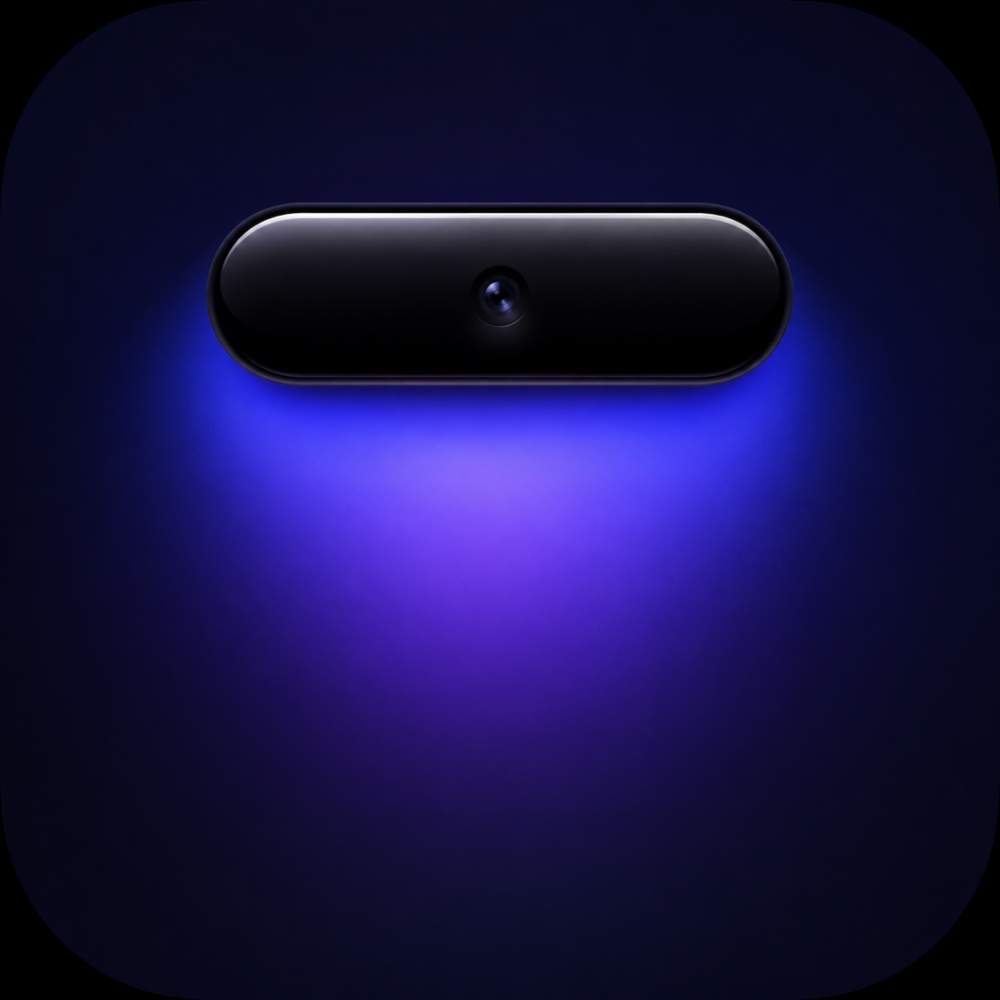

# Notchly

<p align="center">
  
</p>

<p align="center">
  <b>精美、轻量、可靠的 macOS 音乐灵动岛</b><br>
  为刘海 Mac 打造，将正在播放、歌词与日常效率工具收纳在一处。
</p>

<p align="center">
  
  
  
  
</p>

---

## 🌟 为什么选择 Notchly？

音乐播放器、歌词、专注计时、日历、电池和临时文件经常分散在不同窗口里。Notchly 利用 Mac 刘海附近的空间，提供一个安静、连续、可随时展开的原生音乐伴随界面。

Notchly 致力于解决这一核心痛点：

- **音乐优先**：实时显示歌曲、歌手、专辑、封面、进度和播放控制。
- **歌词可靠**：网易云音乐优先、LRCLIB 自动回退，并保留作词、作曲、编曲等署名信息。
- **交互自然**：鼠标悬停、菜单栏图标、点击或全局快捷键即可展开和收起。
- **本地优先**：设置、歌词缓存、专注状态和文件暂存均在本机处理；第三方请求边界公开透明。
- **原生体验**：SwiftUI 与 AppKit 结合，支持多桌面、真实刘海定位和 macOS 系统通知。

---

## ✨ 核心特性

### 1. 音乐与歌词

- 支持 Apple Music、Spotify，以及网易云音乐、QQ 音乐、酷狗、酷我和汽水音乐的系统媒体会话。
- 播放进度、当前时间和总时长来自播放器真实状态；切歌时进度条直接切换到新曲目。
- 多歌词源自动回退，成功结果本地缓存；没有可靠歌词时显示明确状态，不用空白区域误导用户。
- 歌词支持 ±3 秒校准，灵动岛和桌面歌词使用同一偏移。
- 作词、作曲、编曲等开场信息作为歌词内容的一部分保留。

### 2. 灵动岛与音乐动效

- 收起态与真实摄像头刘海保持连续，展开态显示专辑封面、歌曲信息、进度和控制按钮。
- 提供频谱、波形、脉冲和“宇宙尘埃”四种本地模拟动效。
- 所有动效不读取系统音频，不需要屏幕录制权限，不上传声音或画面。
- 支持点击封面返回播放器；点击岛外或按 `Esc` 收起。

### 3. 专注与日常工具

- 专注计时支持开始、暂停、继续、重置和结束提醒。
- 喝水、久坐提醒支持 5–180 分钟自定义间隔，并可立即发送一条健康提醒确认通知权限。
- 电池、日历和文件暂存入口与歌词区域统一对齐。
- 文件暂存支持拖入、Finder 定位、容量上限、保存期限和一键清空。
- 独立桌面歌词支持单行/双行、KTV 渐变、主题、字号、背景透明度、拖动和锁定穿透。

---

## 🔒 隐私与系统权限

Notchly 不提供账号、广告、遥测或自建数据收集服务。详情请查阅完整的 [隐私政策](PRIVACY.md)。

首次使用对应功能时，Notchly 可能请求以下 macOS 标准权限：

1. **日历**：读取下一场非全天日程，仅用于岛内展示。
2. **自动化（Apple Events）**：读取和控制已运行的 Apple Music 或 Spotify。
3. **通知**：发送专注、喝水和久坐提醒。
4. **网络访问**：匹配同步歌词和加载远程专辑封面。
5. **文件访问**：仅处理用户主动拖入文件暂存区域的项目。

Notchly 不读取键盘输入、屏幕内容或系统音频，也不需要屏幕录制权限。权限可在“系统设置 → 隐私与安全性”中撤销。

---

## 🚀 下载与安装

### 预编译版本下载

前往 [GitHub Releases](https://github.com/lglglglglg/Notchly/releases) 下载最新版本 ZIP，解压后将 `Notchly.app` 拖入“应用程序”文件夹。

也可以先访问 [Notchly 官方网站](https://lglglglglg.github.io/Notchly/) 了解功能并下载最新版本。

Alpha 版本面向开发和测试；正式发行包应使用 Developer ID Application 签名并完成 Apple 公证。

### 本地编译源码

要求：macOS 14.0+、Xcode 15+、Swift 6 工具链，以及 [XcodeGen](https://github.com/yonaskolb/XcodeGen)。

```bash
git clone git@github.com:lglglglglg/Notchly.git
cd Notchly

# 生成 Xcode 工程并编译打包
./scripts/package-stable.sh
```

构建产物将输出至 `dist/Notchly.app` 与 `dist/Notchly-<版本>-alpha.zip`。脚本默认使用 ad-hoc 签名；正式签名时设置 `NOTCHLY_SIGNING_IDENTITY`。

---

## ⌨️ 常用快捷键与操作

| 动作 | 交互方式 |
| :--- | :--- |
| **展开 / 收起灵动岛** | 鼠标悬停刘海、点击菜单栏图标或全局快捷键 `⌘⇧Space` |
| **播放控制** | 上一曲、播放/暂停、下一曲按钮 |
| **返回播放器** | 点击专辑封面 |
| **歌词校准** | 歌词右侧校准控件，或设置中的时间偏移 |
| **打开设置** | 展开灵动岛右上角齿轮 |
| **管理文件暂存** | 将文件拖到“文件暂存”区域后点击入口 |

---

## 📄 开源许可证与署名

- **版权所有**：© 2026 **Stephan Li**（韩十久工作室 · Hanshijiu Studio）
- **开源协议**：本项目基于 [MIT License](LICENSE) 协议开源，欢迎自由交流、使用与衍生开发。
- **公开联系邮箱**：`lixiaolongstephan@gmail.com`

---

## 👨‍💻 创作团队

- **工作室**：韩十久工作室（Hanshijiu Studio）
- **主理人**：Stephan Li
- **项目仓库**：[github.com/lglglglglg/Notchly](https://github.com/lglglglglg/Notchly)

欢迎提交 Issue 和 Pull Request，一起把 Notchly 打造得更加精美、可靠。

---

## 📚 项目文档

- [隐私政策](PRIVACY.md)
- [安全说明](SECURITY.md)
- [证书与发布说明](docs/证书与发布说明.md)
- [发布准备清单](docs/发布准备清单.md)
- [贡献规范](CONTRIBUTING.md)
- [赞助支持](docs/DONATE.md)
- [项目署名与发布信息](docs/项目署名与发布信息.md)
- [第三方许可](Notchly/THIRD_PARTY_NOTICES.txt)

详细的版本变更和修复记录请查看 [CHANGELOG.md](CHANGELOG.md)，不在本 README 中展开。

## ⚠️ 当前限制

- 国内播放器兼容层使用私有 `MediaRemote.framework`，当前功能集不适合直接提交 Mac App Store。
- 歌词和远程封面的可用性、准确性及内容授权由相应第三方服务决定。
- Notchly 当前处于 Alpha 阶段，正式发布前仍需完成公证包、更新机制和未参与开发设备验收。
